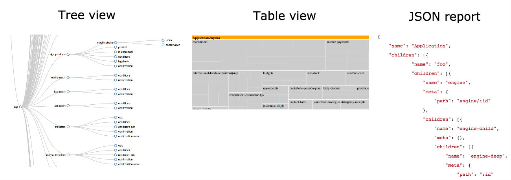
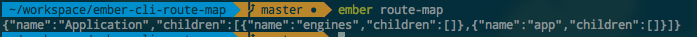
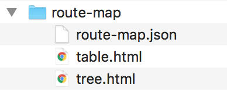

# ember-cli-route-map

[](https://travis-ci.org/BBVAEngineering/ember-cli-route-map)
[](https://badge.fury.io/gh/BBVAEngineering%2Fember-cli-route-map)
[](https://badge.fury.io/js/ember-cli-route-map)
[](https://david-dm.org/BBVAEngineering/ember-cli-route-map)

Command to generate a route map of your Ember application.

To see what can be done [visit the example page](https://bbvaengineering.github.io/ember-cli-route-map/), it's the real route map from the [BBVA Mobile App](https://movil.bbva.es/)!



## Installation

```
ember install ember-cli-route-map
```

### Usage

#### Output result in the console

Run the next command:

```bash
ember route-map
```



#### Storing the report inside a directory

Use `--output` to select an output dir:

```bash
ember route-map --output="reports/route-map/"
```

#### Pretty output, save in HTML format

Use `--pretty` and `--output`:

```bash
ember route-map --output="reports/route-map/" --pretty
```



#### ¿How can I add another directory to the report?

If your project have a different directory tree from the official Ember project you can use the `--globs` flag.
It accepts an Array of directories and remember to add all the paths because the default directories will be overriden.

```bash
ember route-map --globs "app/router.js" --globs "addons/*/reopens/router.js" --globs "lib/*/addon/routes/routes.js"
```

## Contribute

If you want to contribute to this addon, please read the [CONTRIBUTING.md](CONTRIBUTING.md).

## Versioning

We use [SemVer](http://semver.org/) for versioning. For the versions available, see the [tags on this repository](https://github.com/BBVAEngineering/ember-cli-remark/tags).

## License

This project is licensed under the MIT License - see the [LICENSE.md](LICENSE.md) file for details
